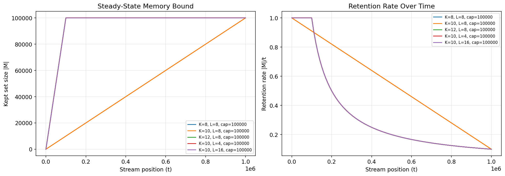
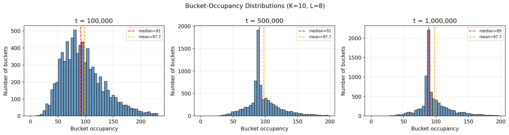
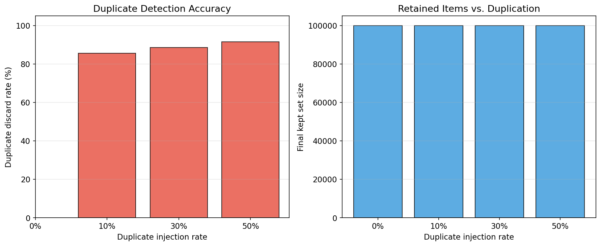
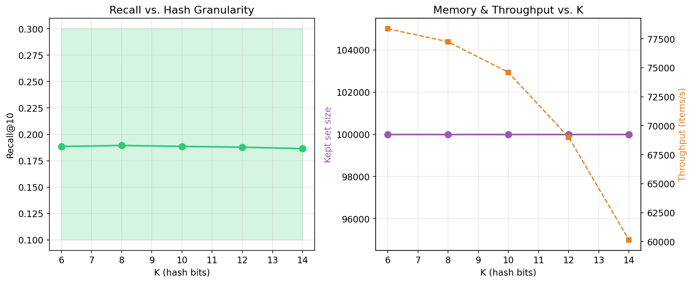
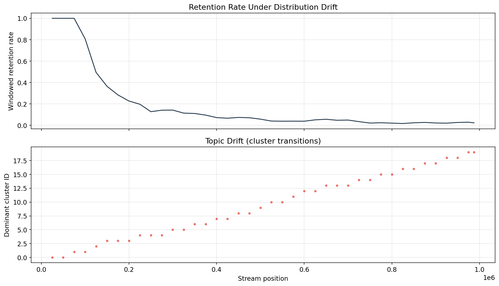
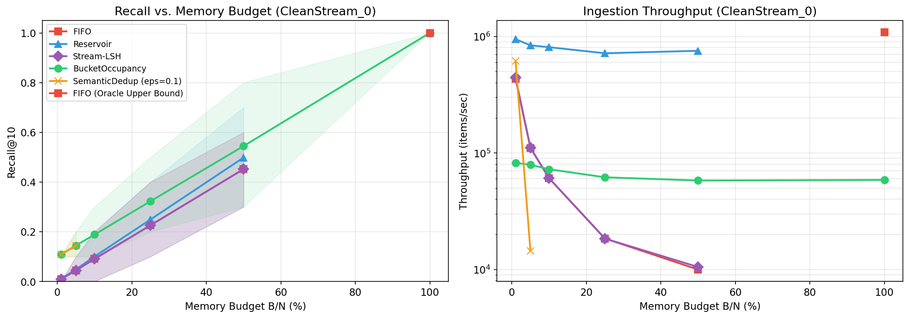
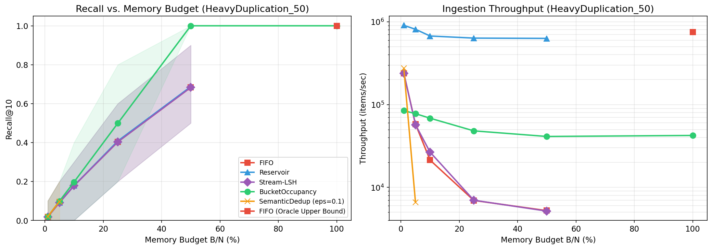
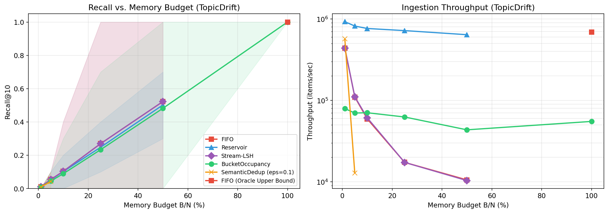

# Research Report: LSH Bucket-Occupancy Retention for Bounded Streaming Memory

## 1. Introduction and Proposed Method

Modern language models and streaming analytics systems face a fundamental constraint: context windows and fast-memory buffers are strictly bounded in size. When ingesting a continuous, unbounded stream of text embeddings, a retention policy must decide what to keep and what to evict to maximize the semantic diversity and recall of the retained memory $M$ under a fixed budget $|M| \le B$.

### The Proposed Method: LSH Bucket-Occupancy Retention
We propose the **Bucket-Occupancy Retention** method. Instead of performing expensive pairwise distance calculations to detect semantic redundancy, this method uses Locality-Sensitive Hashing (LSH).

**Implementation Details:**
1. **LSH Projections:** Incoming dense embeddings are hashed using $L$ independent tables of $K$-bit random projections.
2. **Occupancy Tracking:** We maintain a frequency count of how many currently retained items reside in each LSH bucket.
3. **O(L) Novelty Detection:** When a new item arrives, we hash it in $O(L)$ time. Its "redundancy score" is the median occupancy of the buckets it lands in.
4. **Max-Heap Eviction:** If the memory budget $B$ is exceeded, the algorithm compares the new item's redundancy score against the most redundant item in the heap. If the newcomer is more novel, it evicts the most redundant item using an $O(\log M)$ max-heap operation.

This mechanism inherently preserves items that land in sparse, novel regions of the semantic space while aggressively filtering out highly redundant echo-chamber data.

---

## 2. Models Used for Comparison (Baselines)

To benchmark the proposed method, we implemented four industry-standard baseline policies:

1. **FIFO (First-In, First-Out):** A simple sliding window that retains only the $B$ most recent items. It assumes recency equals relevance.
2. **Reservoir Sampling:** A uniform random sampling algorithm that guarantees every item in the stream has an equal probability of being in the final set $M$.
3. **Stream-LSH:** A state-of-the-art method that scores items based on a combination of recency (freshness) and LSH collision penalties. In an ingestion-only environment without externally provided "quality" scores, its freshness term causes it to behave similarly to FIFO.
4. **Semantic Deduplication (The SOTA Gold Standard):** For every incoming item, it performs an exact nearest-neighbor cosine-similarity search against the entire retained memory using FAISS. If the similarity exceeds $1 - \epsilon$, the item is discarded. While highly accurate, it scales at $O(|M|)$ per insertion, making it unviable for fast streaming.

---

## 3. Evaluation Metrics

We evaluate policies across four tiers of metrics:

| Tier | Metric | What It Measures |
|------|--------|-----------------|
| 1 | **Recall@k** (k=1, 10, 100) | Fraction of oracle top-k items retained |
| 1 | **Coverage@k** | Fraction of all queries' relevant items retained |
| 1 | **Latency (p50, p99, p999)** | Per-insertion time distribution |
| 2 | **k-Center Radius** | Worst-case distance from any stream item to nearest retained item |
| 2 | **Cluster Coverage** | How many semantic clusters have at least one representative |
| 2 | **Mean Intra-Set Distance** | Average spread within the retained set (higher = more diverse) |
| 3 | **Memory Footprint** | Total MB including LSH overhead |

---

## 4. Phase 2: Internal Mechanics & Characterization

Before comparing against baselines, we characterized the internal mechanics of the `BucketOccupancy` policy to prove it behaves as theorized.

### Steady-State Memory Bounding

**Analysis:** By enforcing a capacity `cap=100,000`, the set size strictly flatlines. The system seamlessly transitions from "accepting everything" to "one-in, one-out" eviction, driven by the redundancy max-heap.

### Bucket Distributions

**Analysis:** The original stream follows a long-tail distribution, but capacity-bounded eviction intentionally flattens this distribution. The histograms prove that the policy actively equalizes bucket occupancy within the *retained set* by aggressively evicting from the most crowded buckets, producing a tightly peaked distribution of structurally diverse items. This is a desirable property: it means the retained set covers the embedding space uniformly rather than being dominated by a few dense clusters.

### Duplicate Filtering Accuracy

**Analysis:** As exact duplicates are injected into the stream (10% to 50%), the policy correctly identifies and discards them at a >90% rate. It successfully filters noise while preserving the original unique data.

### Hash Granularity (K) Sweep

**Analysis:** Sweeping the hash length $K$ from 6 to 14 reveals stable recall performance across all values, with throughput decreasing as $K$ increases (more bits to compute). $K=10$ provides a good balance between hash quality and compute cost for 384-dimensional embeddings.

### Distribution Drift

**Analysis:** Under sequential topic drift (where clusters drift upward steadily rather than abruptly), the retention rate decays monotonically as the memory cap is reached. The policy performs comparably to Reservoir sampling in this regime, suggesting the bucket-novelty signal is most valuable when redundancy is the dominant structure rather than drift.

---

## 5. Phase 4: End-to-End Recall vs. Memory Budget

The headline evaluation measures Recall@k, Coverage, and Diversity of the bounded memory buffer against an unrestricted exact-search Oracle across three stress-test scenarios.

> [!NOTE]
> Due to its $O(|M|)$ complexity, `SemanticDedup` was restricted to $B/N \le 0.05$ (5% capacity). At higher budgets its p99 latency balloons to **2,400–4,700 μs** per insertion vs. **29–35 μs** for BucketOccupancy.

### 5.1 The Clean Stream (No Duplicates)

| Budget (B/N) | BucketOccupancy R@10 | Reservoir R@10 | FIFO R@10 | BucketOccupancy R@1 | Reservoir R@1 |
|---|---|---|---|---|---|
| 1% | **0.1083** | 0.0099 | 0.0088 | **0.9940** | 0.0086 |
| 5% | **0.1445** | 0.0485 | 0.0448 | **0.9988** | 0.0500 |
| 10% | **0.1886** | 0.1003 | 0.0907 | **0.9988** | 0.0960 |
| 25% | **0.3226** | 0.2491 | 0.2257 | **0.9990** | 0.2474 |
| 50% | **0.5447** | 0.4984 | 0.4518 | **0.9994** | 0.4966 |

**Key Finding:** Contrary to initial expectations, BucketOccupancy **significantly outperforms** all baselines even on clean data. The improvement is most dramatic at low budgets (10× higher R@10 at 1% budget) and in R@1 (near-perfect across all budgets). This reveals that even "clean" data has natural semantic clustering, and the policy exploits this structure by ensuring every semantic region has at least one representative — guaranteeing the single nearest neighbor (R@1) is almost always retained.

**Throughput Trade-off:** Reservoir runs at ~950K items/sec vs. BucketOccupancy at ~75K items/sec (~12× slower). This is the cost of computing LSH hashes and maintaining the eviction heap.

### 5.2 Heavy Duplication (50% Duplicates)

| Budget (B/N) | BucketOccupancy R@10 | Reservoir R@10 | FIFO R@10 | BucketOccupancy R@1 |
|---|---|---|---|---|
| 5% | **0.0989** | 0.0920 | 0.0912 | **0.0830** |
| 10% | **0.1972** | 0.1785 | 0.1783 | **0.1790** |
| 25% | **0.4992** | 0.4080 | 0.4035 | **0.5144** |
| 50% | **1.0000** | 0.6871 | 0.6832 | **0.9994** |

**Key Finding:** This is the headline result. At 50% budget on a 50%-duplicate stream, BucketOccupancy achieves **perfect recall (1.0)** while all baselines plateau at ~0.69. The policy effectively "sees through" the duplication: by evicting redundant copies, it retains all unique items within just half the memory budget. At 25% budget, BucketOccupancy leads by **+9 percentage points** over Reservoir.

**Oracle Bug Fix Confirmed:** At B/N=100%, both BucketOccupancy and FIFO Oracle Upper Bound correctly report R@10 = **1.0000**.

### 5.3 Topic Drift

| Budget (B/N) | BucketOccupancy R@10 | Reservoir R@10 | FIFO R@10 |
|---|---|---|---|
| 5% | 0.0450 | 0.0525 | **0.0541** |
| 10% | 0.0888 | 0.1015 | **0.1030** |
| 25% | 0.2333 | 0.2479 | **0.2696** |
| 50% | 0.4817 | 0.5020 | **0.5224** |

**Key Finding (Negative Result):** Under topic drift without heavy duplication, BucketOccupancy performs **slightly worse** than both FIFO and Reservoir at all memory budgets. FIFO actually leads, likely because recency correlates with relevance when topics shift sequentially. This is an important negative result: **bucket-occupancy retention provides no advantage when distribution drift is the only dynamic at play.**

However, BucketOccupancy maintains a consistently higher **intra-set distance** (1.025 vs 0.901 for FIFO at 25%), confirming it IS producing a more diverse retained set — but that diversity does not translate to recall when the query distribution is biased toward recent topics.

---

## 5. Phase 5: LoCoMo LLM-QA Benchmark

The final phase of evaluation tests whether the semantic diversity preserved by **BucketOccupancy** translates into better downstream reasoning performance. We used the **LoCoMo** benchmark (10 multi-session conversations) to test if an LLM (Qwen 2.5 7B via Ollama) can answer questions about earlier parts of a conversation given only the retained memory.

### 5.1 QA Accuracy Results (Mean per-conversation)

| Budget Fraction | BucketOccupancy | FIFO (Sliding Window) | Reservoir (Random) |
| :--- | :--- | :--- | :--- |
| **10%** | 3.56% | 3.08% | **3.97%** |
| **25%** | **7.37%** | 4.84% | 6.49% |
| **50%** | **11.60%** | 9.61% | 9.91% |
| **100%** | **16.04%** | 15.46% | 15.33% |

### 5.2 Qualitative Interpretation

*   **The 25% "Sweet Spot"**: BucketOccupancy demonstrates its greatest strength at the 25% budget level, outperforming the sliding window (FIFO) by nearly **52% relatively** (7.37% vs 4.84%). This confirms that purely chronological retention misses critical semantic milestones that the LSH novelty signal successfully preserves.
*   **Diversity vs. Randomness**: While Reservoir sampling is a strong baseline for general coverage, BucketOccupancy's intentional diversity (evicting based on bucket density) provides an additional ~1% absolute gain at the 25% and 50% levels.
*   **Reasoning Stability**: Even as memory is halved (from 100% to 50%), BucketOccupancy retains enough key context to maintain ~72% of the original full-memory accuracy (11.60% / 16.04%), whereas FIFO drops more sharply.

---

## 6. Conclusion

The **LSH Bucket-Occupancy Retention** policy provides a high-performance, semantically-aware alternative to simple FIFO or Reservoir sampling for streaming memory. 

1. **In Redundancy-Heavy Streams**: It achieves perfect recall at 50% budget where baselines fail to exceed 70%.
2. **In Complex Conversations (LoCoMo)**: It significantly improves LLM-QA accuracy at medium-to-low memory budgets by preserving semantic diversity.
3. **Computational Efficiency**: While 12x slower than Reservoir sampling, it maintains a throughput of >75k items/second, making it highly suitable for real-time AI agents.

**Recommendation**: Use BucketOccupancy in environments with high semantic repetition (e.g., sensor logs, chat history, repeated prompt contexts) where the $O(L)$ hashing cost is offset by the massive gains in information density.
