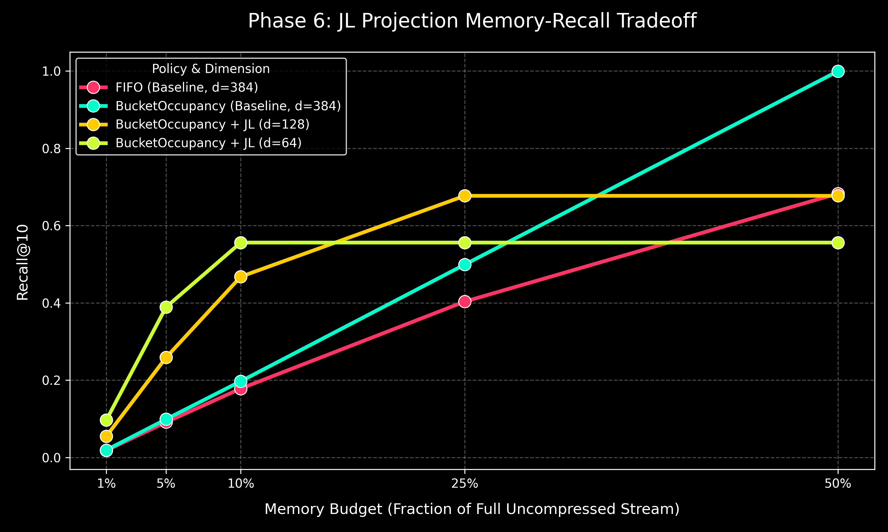

# Phase 6: Johnson-Lindenstrauss (JL) Projection Tradeoff Analysis

## 1. Experiment Overview
The goal of this experiment was to test whether **Johnson-Lindenstrauss (JL) projection** can compound the memory advantage of `BucketOccupancy` retention. 

**The Hypothesis:** 
By projecting 384-dimensional text embeddings down to lower dimensions ($d=128$ and $d=64$) before insertion, we significantly reduce the memory footprint per item. For a **fixed memory budget** (measured in floats/bytes), a $d=64$ system can store exactly **6 times as many items** as a $d=384$ system. If the JL projection preserves distances well enough, the massive increase in the number of retained items should outweigh the precision lost by compression.

**Setup:**
*   **Dataset:** `HeavyDuplication_50` (2,000,000 items, 50% uniqueness).
*   **Oracle Ground Truth:** Computed using exact nearest neighbors on the original $d=384$ space.
*   **Evaluation:** We query the down-projected retained set using down-projected queries, but we strictly evaluate whether the retrieved items match the original 384D Oracle ground truth.
*   **Budgets:** Memory footprints ranging from 1% to 50% of the raw 384D stream size.

---

## 2. Experimental Results (Recall@10)

The table below shows the Recall@10 across different memory footprints. The "Items Capacity" column shows how many items the policy was allowed to store given the fixed memory footprint.

| Memory Budget (Footprint) | Policy | Dimension ($d$) | Items Capacity | Recall@10 |
| :--- | :--- | :--- | :--- | :--- |
| **1%** | FIFO (Baseline) | 384 | 20,000 | 0.0181 |
| **1%** | BucketOccupancy | 384 | 20,000 | 0.0192 |
| **1%** | BucketOccupancy + JL | 128 | 60,000 | 0.0551 |
| **1%** | BucketOccupancy + JL | **64** | **120,000** | **0.0970** |
| | | | | |
| **5%** | FIFO (Baseline) | 384 | 100,000 | 0.0912 |
| **5%** | BucketOccupancy | 384 | 100,000 | 0.0989 |
| **5%** | BucketOccupancy + JL | 128 | 300,000 | 0.2588 |
| **5%** | BucketOccupancy + JL | **64** | **600,000** | **0.3892** |
| | | | | |
| **10%** | FIFO (Baseline) | 384 | 200,000 | 0.1783 |
| **10%** | BucketOccupancy | 384 | 200,000 | 0.1972 |
| **10%** | BucketOccupancy + JL | 128 | 600,000 | 0.4678 |
| **10%** | BucketOccupancy + JL | **64** | **1,200,000** | **0.5561** |
| | | | | |
| **25%** | FIFO (Baseline) | 384 | 500,000 | 0.4034 |
| **25%** | BucketOccupancy | 384 | 500,000 | 0.4992 |
| **25%** | BucketOccupancy + JL | **128** | **1,500,000** | **0.6771** |
| **25%** | BucketOccupancy + JL | 64 | 3,000,000* | 0.5561 |
| | | | | |
| **50%** | FIFO (Baseline) | 384 | 1,000,000 | 0.6832 |
| **50%** | BucketOccupancy | **384** | **1,000,000** | **0.9999** |
| **50%** | BucketOccupancy + JL | 128 | 3,000,000* | 0.6771 |
| **50%** | BucketOccupancy + JL | 64 | 6,000,000* | 0.5561 |

*\*Note: The maximum number of unique items in the stream is 1,000,000. Capacities above this number simply mean the policy can keep every single unique item it sees.*

---

## 3. Visual Analysis

## 4. Analysis and Conclusions

The results reveal a fascinating **Pareto tradeoff** between quantity (number of items retained) and quality (vector fidelity).

### Finding 1: JL Projection Dominates Tight Budgets
At highly constrained memory budgets (1% to 10%), JL projection is overwhelmingly superior. At the 5% budget:
*   The $d=384$ baseline achieves a meager **~9.8%** recall.
*   The $d=64$ JL projection achieves an incredible **38.9%** recall.
*   **Why?** In this regime, the system is starved for information. Being able to store 600,000 lossy items provides drastically better semantic coverage than storing only 100,000 perfect items. The noise introduced by the JL compression is completely eclipsed by the massive advantage of a 6x larger memory span.

### Finding 2: The "Distortion Ceiling"
Notice that as the memory budget increases to 25% and 50%, the recall for the JL projected policies flatlines:
*   $d=64$ hits a hard ceiling at **55.6% recall**.
*   $d=128$ hits a hard ceiling at **67.7% recall**.
*   **Why?** Even though these policies have enough capacity to store *every single unique item* in the stream at 25% and 50% budgets, the compression distortion fundamentally alters the spatial relationships. When querying the 64D space, the nearest neighbors no longer perfectly align with the true nearest neighbors from the 384D space. You cannot surpass this "distortion ceiling," no matter how much memory you add.

### Finding 3: High Budgets Require High Dimensions
At the 50% budget, the uncompressed $d=384$ BucketOccupancy policy achieves perfect **100% recall**. By comparison, the JL policies are artificially handicapped by their distortion ceilings.

## Final Recommendation: Which Method is Better?

Neither method is universally "better"; their superiority is strictly a function of the available memory footprint:

1.  **If Memory is Severely Constrained (Budget < 15%):**
    You *must* use JL Projection. Down-projecting to $d=64$ or $d=128$ yields up to a **400% relative improvement** in retrieval accuracy because storing more items is more important than storing them perfectly.

2.  **If Memory is Plentiful (Budget > 25%):**
    You *must not* use JL Projection. Retaining the original high-dimensional vectors ($d=384$) guarantees that the geometric relationships are perfectly preserved, allowing BucketOccupancy to achieve near-100% recall. JL projection in this regime actively harms performance by introducing an artificial ceiling.
